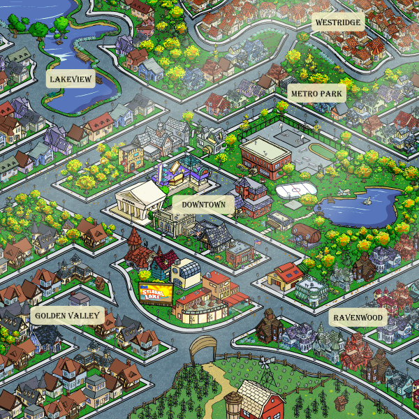
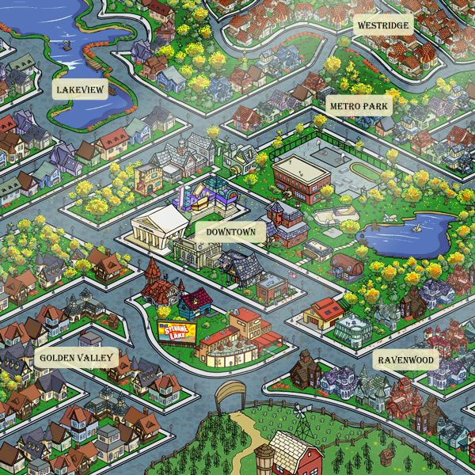
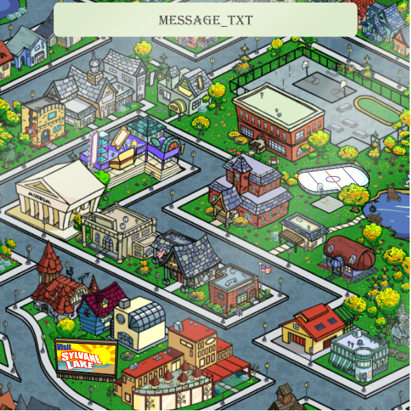
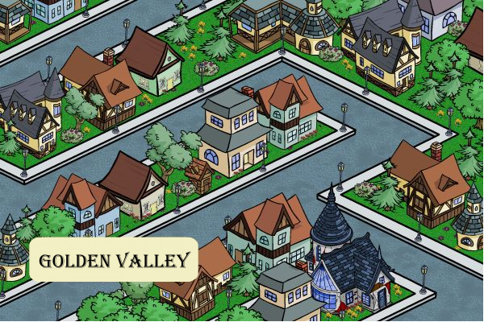
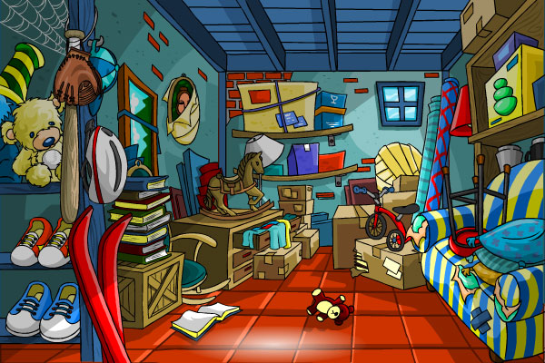
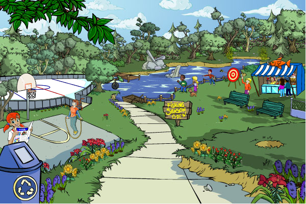
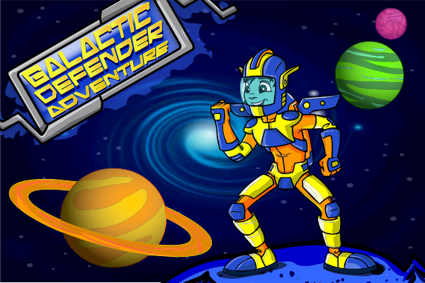
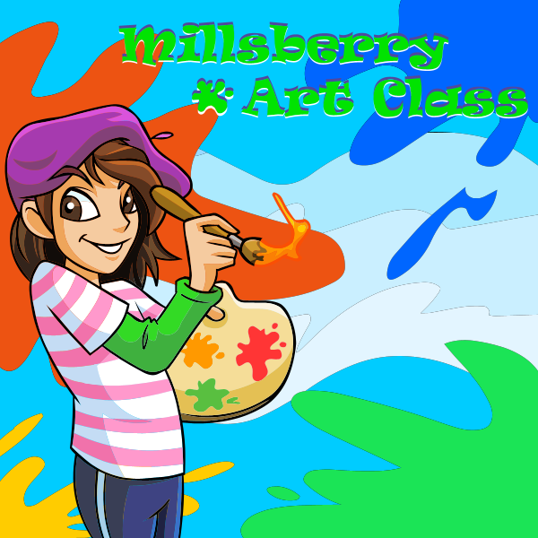
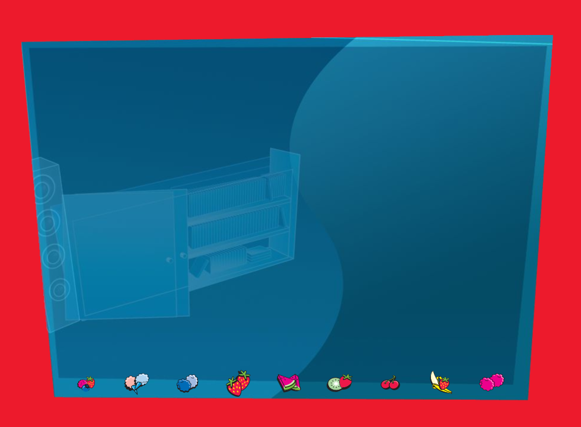

# Millsberry Reborn

I'm rebuilding as much of Millsberry as I can from preserved pages, recovered assets, and archived references. This repository contains the replay server, the material recovered so far, and my working notes from the restoration.

The project is still incomplete, but the public replay is available at [millsberry.markshaw.ca](https://millsberry.markshaw.ca/).

## Project Links

- [Official website and public replay](https://millsberry.markshaw.ca/)
- [Millsberry Reborn Discord](https://discord.gg/p8H9Dtajgz)
- [Ko-fi](https://ko-fi.com/markshaw97)
- [Patreon](https://www.patreon.com/cw/MarkShaw97)

## What's in This Repository

- `app/` - the replay server, Docker packaging, and local runtime assets.
- `official-core-recovered/`, `official-recovered/`, `official-recovered-assets/`, and `official-full-backup/` - recovered Millsberry source trees and assets.
- `recovery-osint/` - route inventories, missing-asset reports, and my recovery notes.
- `recovery-tools/` - tools used during the recovery work.
- `another-user-backup-attempt/` - an earlier community backup attempt, kept separate so its origin remains clear.

## Trying the Replay

- URL: [https://millsberry.markshaw.ca/](https://millsberry.markshaw.ca/)
- Demo login: `testcitizen` / `millsberry`

## Status

The replay is usable, but there are still missing pages, assets, and interactions. I keep the current recovery status in [`app/STATUS.md`](app/STATUS.md) and [`app/ARCADE_RECOVERY.md`](app/ARCADE_RECOVERY.md).

The public launcher also displays its deployed Git branch, exact commit, current recovery counts, community links, and support options. The same deployment information is available from [`/__project-status.json`](https://millsberry.markshaw.ca/__project-status.json).

## Contributing

I welcome pull requests that recover missing material, verify archived sources, improve route reconstruction, fix replay problems, or clarify the documentation.

Before opening a pull request, please read [`CONTRIBUTING.md`](CONTRIBUTING.md). The missing-request reports in `recovery-osint/` and local replay output are good places to find gaps worth investigating.

## Supporting the Work

Support helps me cover hosting, archival storage, testing, and the time involved in tracking down and rebuilding missing parts of Millsberry.

- [Support the project on Ko-fi](https://ko-fi.com/markshaw97)
- [Join as a monthly supporter on Patreon](https://www.patreon.com/cw/MarkShaw97)

The recovered material stays available to the public. Support does not purchase ownership, a guaranteed feature, or a delivery deadline.

## Gallery

These previews were extracted from the first frames of recovered SWF files. The live site has a [searchable gallery with 669 images](https://millsberry.markshaw.ca/swf-teasers).

<table>
<tr>
<td align="center"> Main Town Map (v30)</td>
<td align="center"> Main Town Map — Fall Season</td>
<td align="center"> Downtown Map (v31)</td>
</tr>
<tr>
<td align="center"> Golden Valley</td>
<td align="center"> Basement</td>
<td align="center"> Peabody Park</td>
</tr>
<tr>
<td align="center"> Galactic Swirl Defender (interior)</td>
<td align="center"> Museum</td>
<td align="center"> Contest Page</td>
</tr>
</table>

## Attribution and Project Status

Millsberry and its original artwork, characters, brands, and game materials belong to their respective rights holders. Millsberry Reborn is an unofficial preservation and replay project and is not affiliated with or endorsed by the original Millsberry operators or rights holders.

Recovered material and earlier community backup material remain identified by source wherever that information is available. Bundled third-party software retains its existing license and notice files in the repository. I do not claim authorship of recovered Millsberry content or third-party work.
